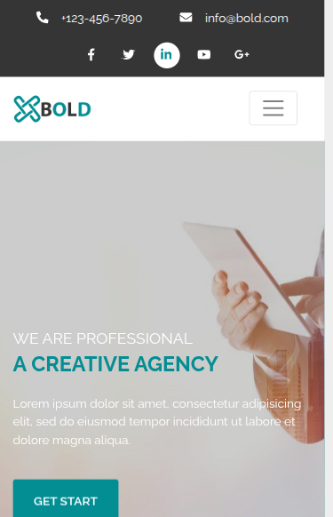

# 🔥 Bold – One Page Creative HTML5 Business Template

**Bold** is a modern, clean, and fully responsive **HTML5 business template** designed to help entrepreneurs, agencies, and professionals create an impressive online presence. Perfect for startups, freelancers, and digital service providers looking to showcase their services in a single-page layout.

---

## 🚀 Template Sections

- **Header** – Navigation and brand identity  
- **Slider** – Hero image or promotion banner  
- **Service** – Showcase your offerings  
- **About** – Describe your business story  
- **Teams** – Highlight your team members  
- **Portfolio** – Display your work  
- **Client** – Testimonials and brand associations  
- **Price** – Pricing plans or packages  
- **Newsletter** – Email opt-in or subscription  
- **Blog** – Share updates and news  
- **Contact** – Get in touch form  
- **Footer** – Legal links and social connections  

---

## 📱 Responsive Preview

  
  

---

## 📂 Project Structure

├── assets
│   ├── css
│   │   ├── animate.css
│   │   ├── bootstrap.min.css
│   │   ├── fontawesome.css
│   │   ├── hover-min.css
│   │   ├── lightbox.min.css
│   │   ├── magnific-popup.css
│   │   ├── main.css
│   │   ├── normalize.css
│   │   ├── owl.carousel.min.css
│   │   ├── preloader.css
│   │   ├── progress.bar.css
│   │   ├── responsive.css
│   │   └── winBox.css
│   ├── images
│   │   ├── 001.jpg
│   │   ├── 003.jpg
│   │   ├── 01_002.jpg
│   │   ├── 01_003.jpg
│   │   ├── 01_004.jpg
│   │   ├── 01_005.jpg
│   │   ├── 01.jpg
│   │   ├── 01.png
│   │   ├── 02_002.jpg
│   │   ├── 02_003.jpg
│   │   ├── 02_004.jpg
│   │   ├── 02_005.jpg
│   │   ├── 02_006.jpg
│   │   ├── 02.jpg
│   │   ├── 02.png
│   │   ├── 03_002.jpg
│   │   ├── 03_003.jpg
│   │   ├── 03_004.jpg
│   │   ├── 03_006.jpg
│   │   ├── 03.jpg
│   │   ├── 03.png
│   │   ├── 04_002.jpg
│   │   ├── 04_003.jpg
│   │   ├── 04_004.jpg
│   │   ├── 04.jpg
│   │   ├── 04.png
│   │   ├── 05_003.jpg
│   │   ├── 05.jpg
│   │   ├── 06_003.jpg
│   │   ├── 06.jpg
│   │   ├── 07.jpg
│   │   ├── 08_002.jpg
│   │   ├── close.png
│   │   ├── faq02.jpg
│   │   ├── footer-1.jpg
│   │   ├── footer-2.jpg
│   │   ├── footer-3.jpg
│   │   ├── footer-4.jpg
│   │   ├── footer-5.jpg
│   │   ├── footer-6.jpg
│   │   ├── footer-7.jpg
│   │   ├── footer-8.jpg
│   │   ├── footer-9.jpg
│   │   ├── footer-bg.png
│   │   ├── index.png
│   │   ├── logo.png
│   │   ├── newsletter-bg.jpg
│   │   ├── next.png
│   │   ├── prev.png
│   │   └── progress-bg.jpg
│   ├── js
│   │   ├── bootstrap.min.js
│   │   ├── circle-progress.min.js
│   │   ├── fontawesome.js
│   │   ├── isotope-docs.min.js
│   │   ├── jquery.barfiller.js
│   │   ├── jquery.counterup.min.js
│   │   ├── jquery.js
│   │   ├── jquery.magnific-popup.min.js
│   │   ├── jquery.preloader.min.js
│   │   ├── jquery.sticky.js
│   │   ├── lightbox.min.js
│   │   ├── main.js
│   │   ├── modernizr.js
│   │   ├── owl.carousel.min.js
│   │   ├── wmBox.js
│   │   └── wow.min.js
│   └── webfonts
│       ├── fa-brands-400.eot
│       ├── fa-brands-400.svg
│       ├── fa-brands-400.ttf
│       ├── fa-brands-400.woff
│       ├── fa-brands-400.woff2
│       ├── fa-regular-400.eot
│       ├── fa-regular-400.svg
│       ├── fa-regular-400.ttf
│       ├── fa-regular-400.woff
│       ├── fa-regular-400.woff2
│       ├── fa-solid-900.eot
│       ├── fa-solid-900.svg
│       ├── fa-solid-900.ttf
│       ├── fa-solid-900.woff
│       └── fa-solid-900.woff2
├── Bold-one-page-creative-HTML5-responsive-template-mobile.png
├── Bold-one-page-creative-HTML5-responsive-template.png
├── index.html
├── LICENSE
└── README.md

---

## 👨‍💻 Developed by Yeachen Abir

I am a passionate **Full-Stack Developer** with a strong focus on **custom website development**, **on-page SEO**, and **digital marketing** strategies. My mission is to craft web solutions that **look stunning**, **perform fast**, and **rank well** on search engines.

### 🌟 CMS Expertise:
- Shopify | BigCommerce | WordPress | Wix  
- Custom CMS with React.js & Next.js  
- eBay Store Design & Optimization  
- Walmart Marketplace Product Optimization  

### 💻 Technical Skills:
- **Frontend**: JavaScript, React.js, HTML, CSS, SCSS, Tailwind CSS, Bootstrap  
- **Backend**: Node.js, Express.js  
- **Database**: MongoDB  
- **Version Control**: Git & GitHub  

### 📈 SEO & Digital Marketing:
- Keyword Research & Meta Optimization  
- On-Page SEO & Content Enhancement  
- Technical SEO: Speed, Mobile, Schema  
- Google Analytics & Search Console  

### 🔗 Let’s Connect!
- 💼 [LinkedIn](https://www.linkedin.com/in/yeachen-abir/)  
- 📘 [Facebook Profile](https://www.facebook.com/yeachen.abir) | [Facebook Page](https://www.facebook.com/profile.php?id=61574159927866)  
- 🐦 [Twitter / X](https://x.com/YeachenA)  
- 📸 [Instagram](https://www.instagram.com/yeachenabir/)  
- 📌 [Pinterest](https://www.pinterest.com/yeachenabir/)  
- 📬 Email: [yeachenabir@gmail.com](mailto:yeachenabir@gmail.com)

---

## 💡 Why Choose the Bold Template?

✅ SEO-Friendly Markup  
✅ Fast & Responsive Layout  
✅ One Page Simplicity  
✅ Built With HTML5, CSS3 & Bootstrap  
✅ Developer Friendly & Easy to Customize  

---

> 🚀 Use this template to launch your business site, portfolio, or client project quickly and effectively.

**#yeachen #abir #webdeveloper #shopify #wordpress #ecommerce #custom_website #react_developer #next_developer #full_stack_developer**

---

